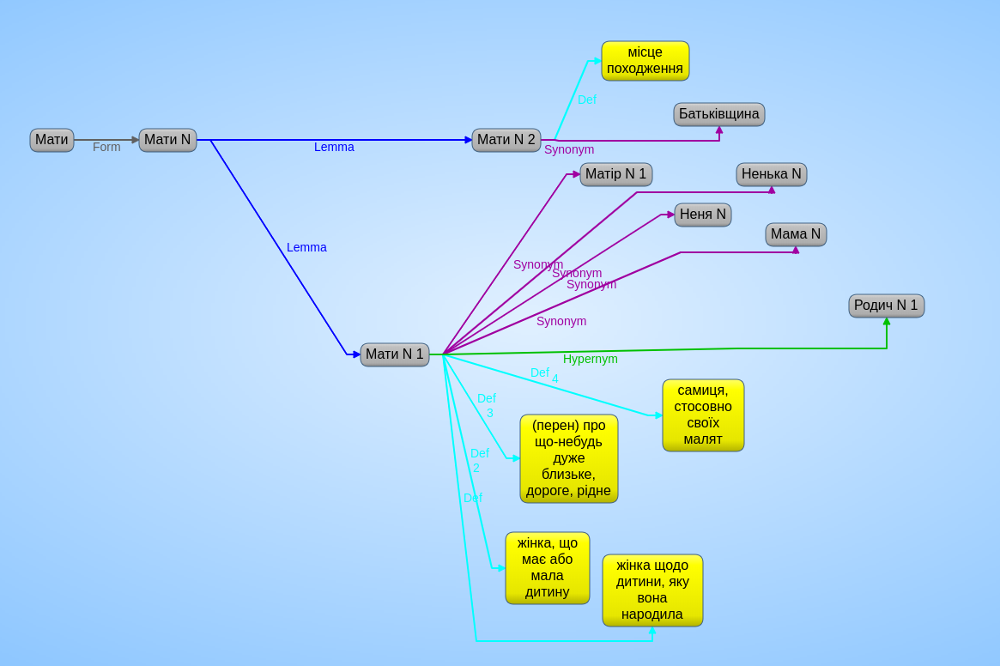
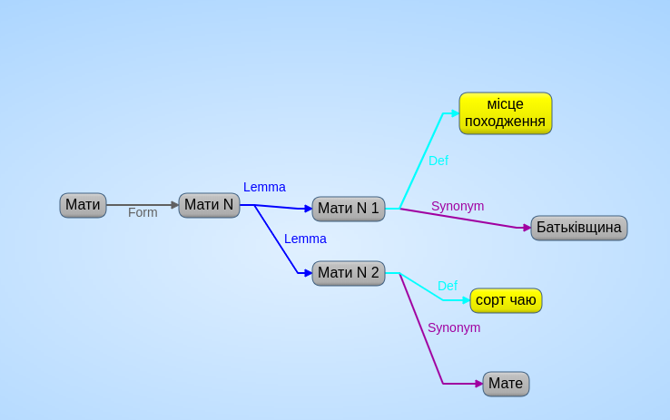
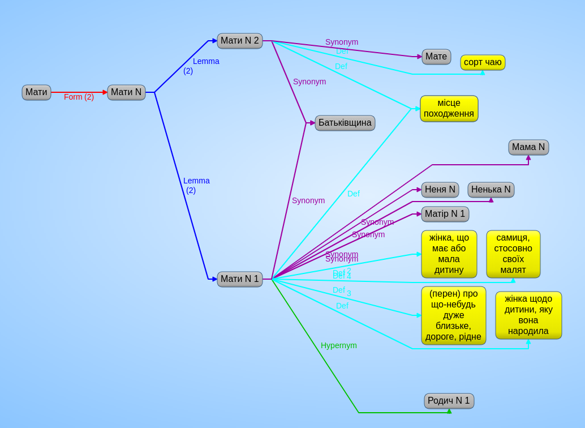
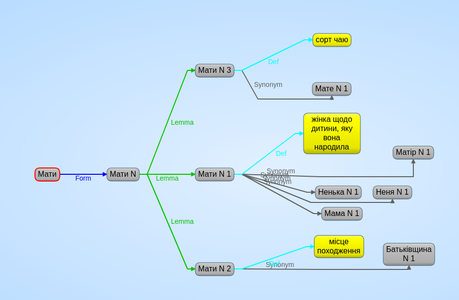

# Обговорення RDF-моделі даних

```
@prefix src: <https://lang.org.ua/wn/src/> .
@prefix w: <https://lang.org.ua/wn/word/> .
@prefix wf: <https://lang.org.ua/wn/wordform/> .
@prefix l: <https://lang.org.ua/wn/lemma/> .
@prefix : <https://lang.org.ua/wn/> .

src:wikt {
  w:мати :form wf:мати_N .
  wf:мати_N :lemma l:мати_N_1 , l:мати_N_2 .
  l:мати_N_1 :hypernym l:родич_N_1 ;
             :synonym l:матір_N_1 , wf:ненька_N , wf:неня_N , wf:мама_N ;
             :def "жінка щодо дитини, яку вона народила" ;
             :def_2 "жінка, що має або мала дитину" ;
             :def_3 "(перен) про що-небудь дуже близьке, дороге, рідне" ;
             :def_4 "самиця, стосовно своїх малят" .
  l:мати_N_2 :synonym w:Батьківщина ;
             :def "місце походження" .
}
```



1. Основний вузол, до якого прив'язані ієрархічні та групові зв'язки — лема (наприклад: `l:мати/N.1`).
2. Дані з кожного джерела поміщаються у відповідний граф (наприклад: `src:wikt/uk`).
3. Еталонні дані, які створює наша система, поміщаються у дефолтний граф
4. Що робити, коли в різних джерелах одна лема має різні значення? Приклад:

```
src:wikt {
  l:мати_N_1 :def "жінка щодо дитини, яку вона народила" ;
             :synonym l:матір_N_1 , wf:ненька_N , wf:неня_N , wf:мама_N .
}
src:ulif {
  l:мати_N_1 :def "місце походження" ;
             :synonym w:Батьківщина .
  l:мати_N_2 :def "сорт чаю" ;
             :synonym w:мате .
}
```



Відповідь наступна:

1. Ми не хочемо плодити зайвих сутностей. Тому ми використовуємо стандартні зв'язки (`:synonym`, а не `:wnSynonym` та `:ulifSynonym`), але прив'язані до конкретного графу-джерела. Так само ми не хочемо створювати вузли `wn_мати/N.1` та `ulif_мати/N.1`, бо вся інформація вже є у перерізу конкретного графу.
2. Загалом, при отриманні інформації з декількох джерел можливі наступні ситуації:
   - набір лем збігається
   - перетин лем не нульовий, але в кожному джерелі є додаткові леми
   - порядок лем переплутаний (як у цьому прикладі)

Так чи інакше, на виході (у дефолтному графі) має бути сформований набір еталонних вузлів і зв'язків. Вони будуть виглядати наступним чином:



```
  l:мати_N_1 :def "жінка щодо дитини, яку вона народила" ;
             :synonym l:матір_N_1 , l:ненька_N_1 , l:неня_N_1 , l:мама_N_1 .
  l:мати_N_2 :def "місце походження" ;
             :synonym l:Батьківщина_N_1 .
  l:мати_N_3 :def "сорт чаю" ;
             :synonym l:мате_N_1 .
```




Те, який порядок лем буде обрано, залежить від алгоритму відбору еталонних вузлів, а не від їх порядку у тому чи іншому джерелі. Загалом, ми не можемо мати якісь гарантії щодо того, що леми в різних джерелах будуть збігатись, мати однаковий набір синонімів або ж хоча б не взаємоперетинаючийся, або що всі зв'язки (такі як синоніми чи гірепніми) будуть використовувати саме леми. Іншими словами, варіант "перехресних" лем — це тільки одна з багатьох можливих неоднозначностей, з якими ми матимимо справу, і ми не можемо для кожної неоднозначності вигадувати особливий спосіб обробки.

Втім, якщо ми зможемо достовірно виявити випадок, коли лема.1 у одному джерелі відповідає лема.2 у іншому, ми зможемо відмітити це окремим зв'язком, наприклад так:

```
src:wikt {
  l:мати_N_1 owl:sameAs _:foo .
  _:foo :graph src:ulif ;
        :lemma :l:мати_N_2 .
}
```

(Де `_:foo` — це т.зв. анонімний вузол).

Хоча, як на мене, це не є принциповим. Загалом, в нашій графовій моделі даних ми застосовуємо наступний підхід:

- кожен вузол має певний набір "сирих" властивостей, на основі яких ми робимо висновки щодо властивостей, які включаємо до нашого ворднету
- застосування графів (4-й елемент кваду) дає можливість бачити "вигляд" всіх даних з певного джерела
